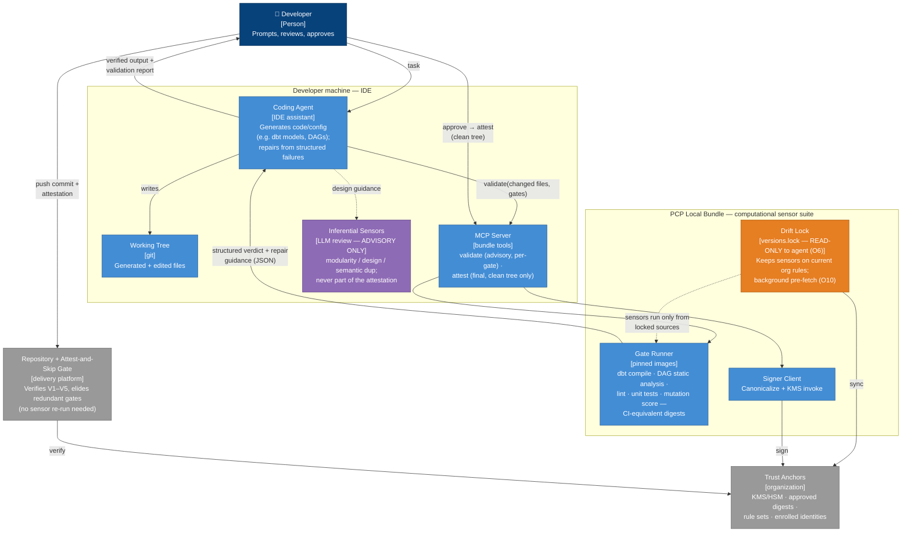
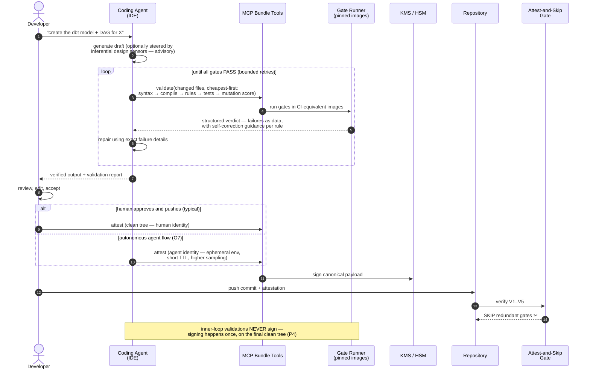

# The PCP bundle as an agent's sensor suite and inner verification loop

PCP was designed so a *pipeline* can trust local execution. The same property serves a
second consumer: a **coding agent working inside the IDE**. Böckeler's work on
[sensors for coding agents](https://martinfowler.com/articles/sensors-for-coding-agents.html)
names the general mechanism precisely: *a sensor is meant to give the agent feedback so
that it can self-correct* — type checkers, linters, dependency rules, tests, deployed
across the session, the pipeline and beyond. The PCP bundle is exactly such a sensor
suite, with two properties generic sensors lack:

- **Sensor fidelity.** A sensor is only as useful as its agreement with the gate that
  ultimately judges the code. An agent running whatever `dbt` happens to be installed is
  sensing against the wrong instrument. Bundle gates run in the *digest-pinned images CI
  uses*, under the *current* rule sets (drift lock + O10 pre-fetch) — so "the sensor is
  green" means "CI's gate will be green" for every hermetic check.
- **Sensor integrity.** Böckeler flags sensor trustworthiness and gaming as an open
  concern. In PCP the gates, lock and rules are read-only to the agent's process (O6):
  the sensors the agent self-corrects against are sensors it cannot recalibrate.

And the connection runs the other way too: Böckeler's pipeline tier *re-runs* the
computational sensors on clean infrastructure because session results are not trusted.
PCP is the missing trust layer that lets the session's sensor runs **count** — the outer
attest-and-skip loop turns the inner loop's final green into a verdict the pipeline can
verify instead of repeat.

The result is one mechanism serving two loops:

- **Inner loop (agent, advisory):** generate → sense against the bundle → repair from
  structured, guidance-rich failures → repeat → present only verified output. No signing.
- **Outer loop (attest-and-skip):** once the human approves and the tree is clean, sign
  once and push; the pipeline verifies in seconds and skips the redundant gates.

## Sensor classes and attestability

Not everything that helps the agent can be attested. Classify each sensor by whether its
verdict is *bindable* (deterministic function of content × tools × rules):

| Sensor class | Examples | Inner loop | Attestable |
|---|---|---|---|
| Computational, hermetic | compile (dbt), DAG static analysis, lint, unit tests, schema/contract validation, **mutation testing** | yes — primary repair signal | **yes** — these are PCP gates |
| Computational, environment-dependent | integration against live services, runtime data-quality checks | optional, when reachable | no — stay at the choke point (SPEC §4) |
| Inferential (LLM-based) | modularity/design review, semantic-duplication detection | yes — advisory guidance | **never** — non-deterministic verdicts cannot bind a rules digest |

The line matters: inferential sensors are valuable *inside* the loop (Böckeler shows LLM
modularity review catching what coupling metrics misread) but their output is an opinion,
not a fact — it can steer generation, it must not enter the signed payload.

## The test suite as a regression sensor — and the reward-hacking connection

Böckeler's sharpest finding for agent workflows: **coverage creates false security when
the agent writes the tests**. A mapper with 100% statement coverage had 13 surviving
mutants — tests that execute code but assert nothing catch nothing. Her remedy is
[mutation testing as the regression sensor](https://martinfowler.com/articles/sensors-for-coding-agents.html#TheTestSuiteAsARegressionSensor):
deliberately mutate the code and require the suite to notice.

For PCP this is more than test hygiene — it is a *computational defense against A5′
(reward hacking)*. An agent that weakens an assert to reach green defeats a coverage
gate silently; it does not defeat a mutation-score gate, because hollow tests stop
killing mutants. Mutation testing is deterministic over content × tool digest ×
threshold, i.e. **attestable**, so the defense travels inside the proof rather than
depending only on O8 sampling after the fact. Recommendation: for changes whose tests
were agent-authored, the gate set SHOULD include a mutation-score gate (threshold-based,
like every hardware-adjacent gate), and the attestation then *proves the tests are real*
— not just that they ran.

## Containers

## Sequence — inner loop, then attest-and-skip

## Considerations

**Advisory vs. signing — a hard line.** The inner loop calls `validate` (advisory)
freely, possibly dozens of times per task; it never touches the signer. `attest` runs
exactly once, on the final, human-visible, clean working tree (P4). This keeps KMS
invocations and the audit log meaningful — one signature per delivered change, not per
repair iteration.

**Guidance-rich verdicts.** Böckeler's most practical finding: agents respond
dramatically better to sensors whose failure messages carry *self-correction guidance*
than to bare rule violations — her customized ESLint messages turned a historically
ignored tool into a useful guide. Bundle gates should do the same: return failures as
structured data (gate, file, line, rule id, message) **plus** a repair hint per rule,
authored once by the platform team in the rule catalog. Rule documents already live in a
governed source of truth; the guidance rides along and stays current via the same drift
lock.

**The agent must not govern its own sensors (O6).** `gates.yaml`, `versions.lock` and
rule documents are read-only to the agent's process — platform-managed, never writable
from the execution environment. Otherwise a reward-hacking agent (A5′) could recalibrate
the very sensors it uses to declare its output valid. Two complementary defenses:
sensors it cannot edit (this), and a mutation-score gate that makes hollow tests visible
(above).

**Identity at attest time.** If the human reviewed and pushes, the human's identity
signs — the agent was a tool, like a compiler. If the agent operates autonomously
end-to-end, O7 applies in full: its own enrolled identity, ephemeral single-use
environment, shorter TTL and a higher O8 sampling rate. Never let an agent sign as the
human who invoked it.

**Feedback timing tiers.** Following Böckeler's deployment model: during-session sensors
(syntax, compile, lint — immediate, watch-mode), per-iteration sensors (rules, unit
tests), and pre-attest sensors (full gate set incl. mutation score — the expensive ones
run once, right before presenting to the human). The attestation then replaces her
pipeline tier's re-run entirely.

**Latency and overload engineering.** Iteration speed is UX, and Böckeler warns about
feedback overload driving agents into over-engineered refactoring spirals. Mitigations:
order gates cheapest-first and fail fast; validate incrementally (only gates whose inputs
changed); keep containers warm between iterations; scope sensor output to the changed
files, not the whole repo; and cap repair retries — after N attempts the agent presents
the failure honestly instead of iterating forever.

**What this buys, end to end.** The user stops receiving output that does not compile;
CI stops seeing pushes that fail on gate one; agent-authored tests carry proof of
effectiveness, not just coverage; and the final push skips the redundant gates entirely
under the attestation. Quality in the inner loop, compute savings in the outer loop —
same bundle, same pins, same rules.

## Validation status

This document is a conceptual proposal. Unlike the protocol core (which has a reference
implementation, a conformance test suite and one industrial case study behind it), the
agent loop has **no implementation and no validated deployment yet**: there is no
empirical evidence so far that sensor fidelity plus sensor integrity reduces reward
hacking in practice, and the latency engineering suggestions are informed judgment, not
measurements. Treat it as a design to pilot, not a result to cite.

---

**Reference:** B. Böckeler, *Maintainability Sensors for Coding Agents*,
martinfowler.com, 2026 — in particular
[The Test Suite as a Regression Sensor](https://martinfowler.com/articles/sensors-for-coding-agents.html#TheTestSuiteAsARegressionSensor).
PCP's contribution to that framework is sensor *fidelity* (CI-equivalent pinned
instruments), sensor *integrity* (agent-immutable calibration), and making the sensors'
final verdict *portable* (the attestation) so the pipeline verifies instead of re-runs.
