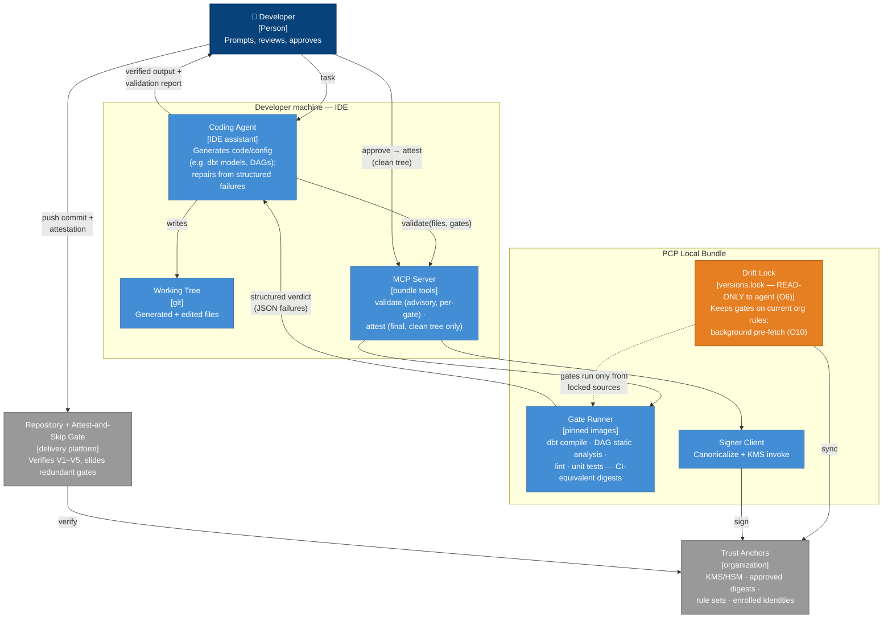
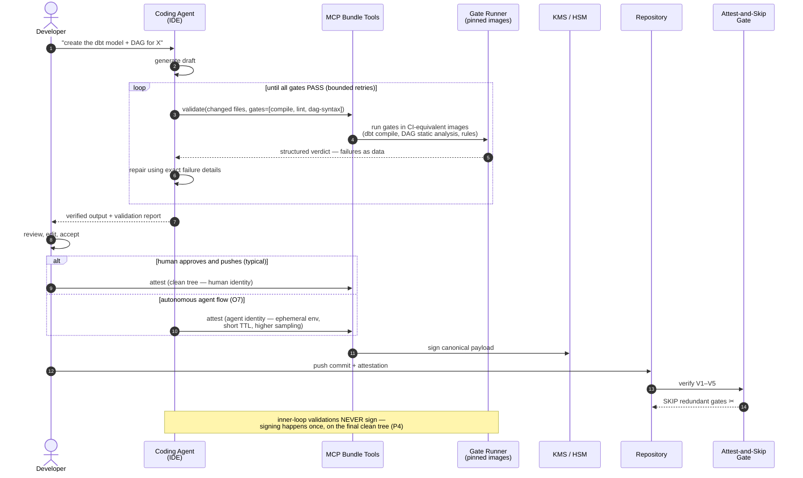

# The PCP bundle as an agent's inner verification loop

PCP was designed so a *pipeline* can trust local execution. The same property serves a
second consumer: a **coding agent working inside the IDE**. The local bundle — pinned gate
images, drift lock, structured verdicts — gives the agent a ground-truth feedback tool, so
it can guarantee that what it hands the user is *at least executable*: it compiles, passes
static analysis, and satisfies the organization's current rules, checked in the same
container images CI will use.

The result is one mechanism serving two loops:

- **Inner loop (agent, advisory):** generate → validate against the bundle → repair from
  structured failures → repeat → present only verified output to the human. No signing.
- **Outer loop (attest-and-skip):** once the human approves and the tree is clean, sign
  once and push; the pipeline verifies in seconds and skips the redundant gates.

The agent's self-checks and the pipeline's trusted skip are the *same gates, same digests,
same rules* — which is precisely why the inner loop is faithful: an output that passes the
bundle cannot fail those gates in CI, modulo drift, and the drift lock closes that too.

## Containers

## Sequence — inner loop, then attest-and-skip

## Considerations

**Advisory vs. signing — a hard line.** The inner loop calls `validate` (advisory) freely,
possibly dozens of times per task; it never touches the signer. `attest` runs exactly once,
on the final, human-visible, clean working tree (P4). This keeps KMS invocations and the
audit log meaningful — one signature per delivered change, not per repair iteration.

**Why bundle checks beat ad-hoc agent checks.** An agent could run `dbt compile` from
whatever happens to be installed — and validate against last month's rules or the wrong
dbt version, then hand the user output that CI rejects. The bundle removes both failure
modes: gates run in the *digest-pinned images CI uses*, and the drift lock (with O10
pre-fetch) keeps rule sets current. "Passes locally" then *means* "passes in CI" for every
hermetic gate.

**The agent must not govern its own gates (O6).** `gates.yaml`, `versions.lock` and rule
documents are read-only to the agent's process — platform-managed, never writable from the
execution environment. Otherwise a reward-hacking agent (A5′) could weaken the very checks
it uses to declare its output valid. The gates the agent self-validates against must be
gates it cannot edit.

**Identity at attest time.** If the human reviewed and pushes, the human's identity signs —
the agent was a tool, like a compiler. If the agent operates autonomously end-to-end, O7
applies in full: its own enrolled identity, ephemeral single-use environment, shorter TTL
and a higher O8 sampling rate. Never let an agent sign as the human who invoked it.

**Latency engineering for the loop.** Iteration speed is UX. Order gates cheapest-first
(syntax → compile → rules → tests) and fail fast; validate incrementally (only gates whose
inputs changed); keep containers warm between iterations; return failures as structured
data (JSON: gate, file, line, rule id, message) so the agent repairs without parsing logs.
The bounded-retries cap prevents infinite repair loops on genuinely hard failures — after N
attempts, the agent should present the failure honestly instead of iterating forever.

**What this buys, end to end.** The user stops receiving output that does not compile; CI
stops seeing pushes that fail on gate one; and the final push skips the redundant gates
entirely under the attestation. Quality in the inner loop, compute savings in the outer
loop — same bundle, same pins, same rules.
