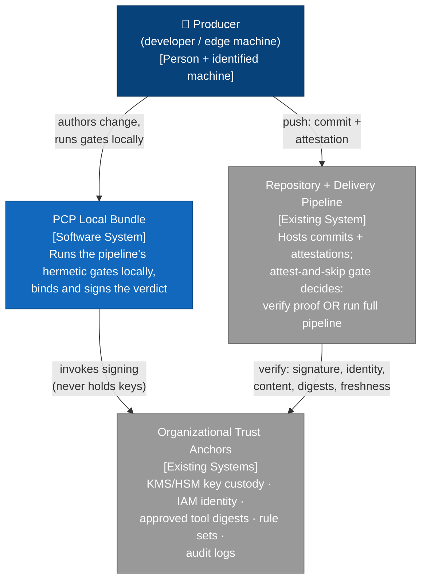
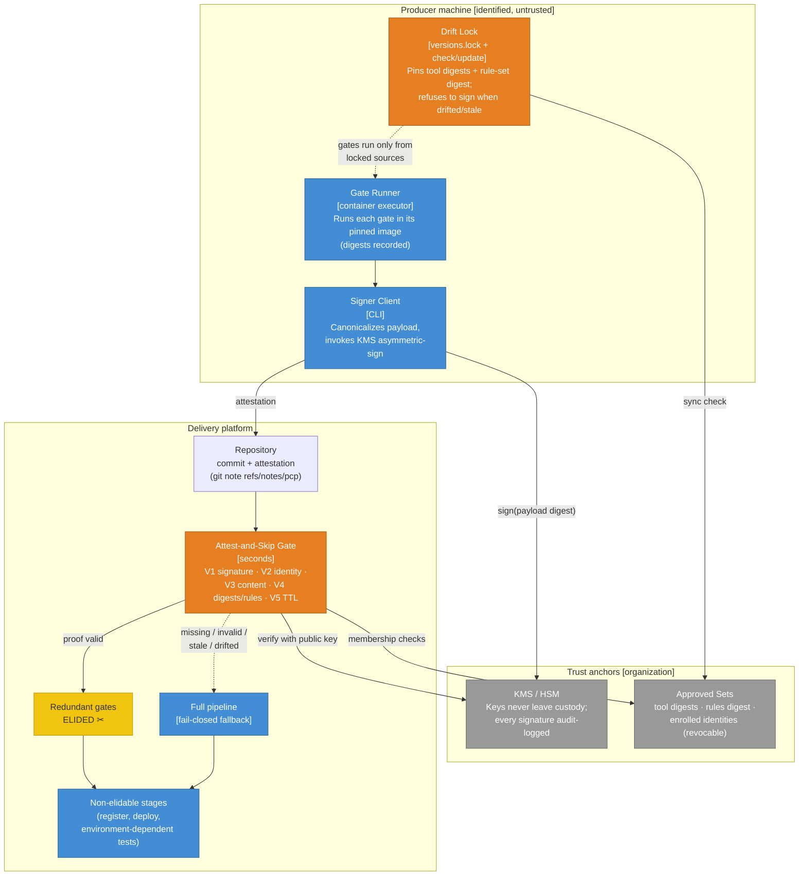
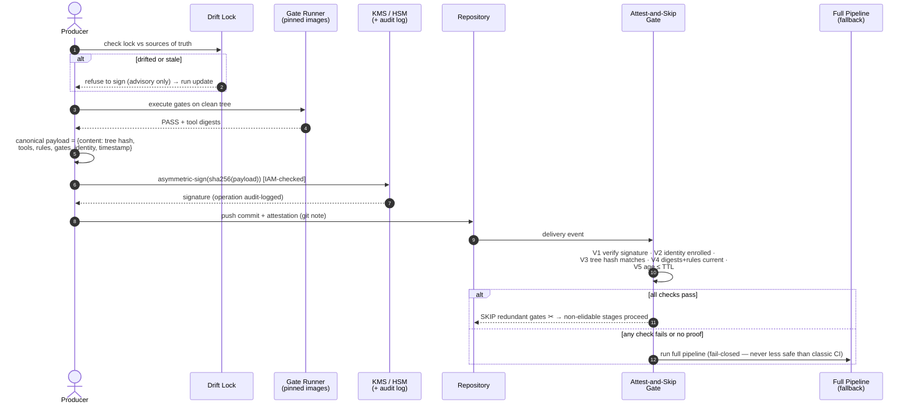

# PCP Architecture — C4 views and the attest-and-skip protocol

This document walks the pattern top-down: **context** (who and what surrounds it), then
**containers** (the moving parts), then the **protocol** (the exchange, step by step).
Diagram sources live in [`../diagrams/`](../diagrams/) as Mermaid; GitHub renders the
copies below natively.

---

## Level 1 — System context

PCP sits between three worlds: identified **producers** (developer workstations, edge
runners) that do the work; the **delivery platform** (repo + pipeline) that must trust the
work; and the **organization's trust anchors** (key custody, identity, approved tooling)
that make the shortcut safe. The pattern's promise: the pipeline's *decision* stays
centralized while its *computation* moves to the edge.

**Reading:** nothing new is trusted. The producer was already trusted to *write the code*;
PCP extends that identity — under audit, revocation and pinned tooling — to *executing the
checks*, while the verifier keeps the final say.

---

## Level 2 — Containers

**Key placements:** the drift lock lives with the producer (it gates *signing*), while the
approved sets live with the organization (they gate *verification*) — drift is therefore
caught on **both** sides, and bumping the approved sets instantly invalidates every
outstanding proof without touching any producer.

---

## The attest-and-skip protocol (sequence)

The verifier is deliberately boring: one signature verification and four set/equality
checks. Its cost bounds the benefit; its simplicity bounds the attack surface.
